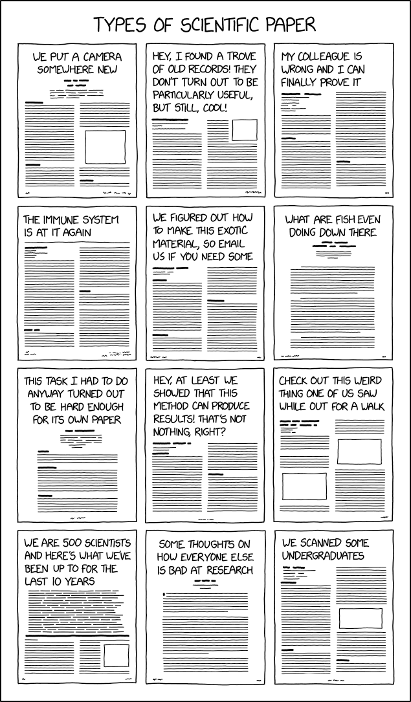
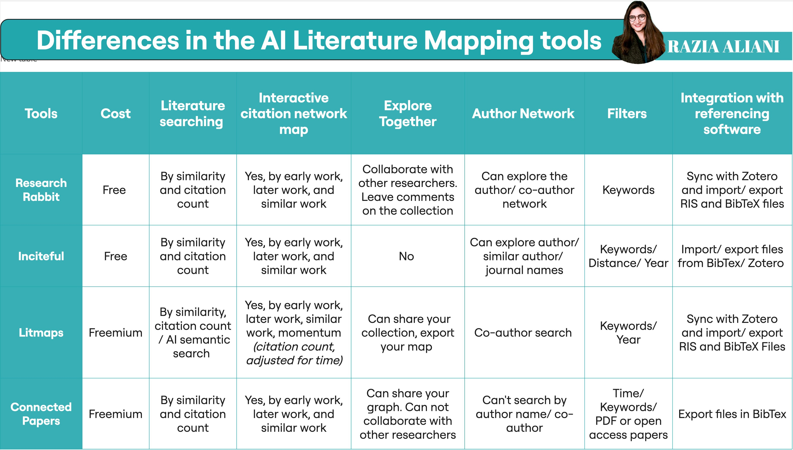

# TC3002B - Desarrollo de aplicaciones avanzadas de ciencias computacionales 

# Scientific writing 

The term scientific writing commonly denotes the reporting of original research in journals through scientific papers that follow a standard format. In its broader sense, scientific writing also includes communication about science through other types of journal articles, such as review papers summarizing and integrating previously published research. And in a still broader sense, it includes other types of professional communication by scientists—for example, grant proposals, oral presentations, and poster presentations. Related endeavors include writing about science for the public, sometimes called science writing.

The key characteristic of scientific writing is clarity. Successful scientific experimentation is the result of a clear mind attacking a clearly stated problem and producing clearly stated conclusions. Ideally, clarity should be a characteristic of any type of communication; however, when something is being said for the first time, clarity is essential. Most scientific papers, those published in our primary research journals, are accepted for publication precisely because they contribute new knowledge. Hence, we should demand absolute clarity in scientific writing.

## Scientific paper 

A scientific paper is a written and published report describing original research results. To properly define a “scientific paper,” we must define the mechanism that creates a scientific paper—namely, valid (that is, primary) publication. Many people have struggled with the definition of primary publication (valid publication), from which is derived the definition of a scientific paper.

The Council of Biology Editors (CBE), now the Council of Science Editors (CSE), arrived at the following definition (Council of Biology Editors 1968,
p. 2):

`
An acceptable primary scientific publication must be the first disclosure containing sufficient information to enable peers (1) to assess observations, (2) to repeat experiments, and (3) to evaluate intellectual processes; moreover, it must be susceptible to sensory perception, essentially permanent, available to the scientific community without restriction, and available for regular screening by one or more of the major recognized secondary services (e.g., currently, Biological Abstracts, Chemical Abstracts, Index Medicus, Excerpta Medica, Bibliography of Agriculture, etc., in the United States and similar services in other countries).
`

At first reading, this definition may seem excessively complex, or at least verbose, however knowing what a scientific paper is and what it is not, is key; so it may be helpful to work through this definition to see what it really means.

- **“An acceptable primary scientific publication” must be “the first disclosure.”:** Disclosure takes a form that allows the
peers of the author (either now or in the future) to fully comprehend and use that which is disclosed. Sufficient information must be presented so that potential users of the data can (1) assess observations, (2) repeat experiments, and (3) evaluate intellectual processes.
- **“Susceptible to sensory perception”:**  In normal practice, it simply means to be published; however, this definition provides for disclosure not just in terms of printed visual materials (printed journals and the no longer widely used media called microfilm and microfiche), but also in nonprint, nonvisual forms. Regardless of the form of publication, that form must be essentially permanent. Therefore, scientific papers receive digital object identifiers (DOIs): internet addresses that persist even if, for example, a journal’s URL changes or the journal ceases publication.
- **Available to the scientific community without restriction:** For example, in a journal that is openly accessible online or to which subscriptions are available, and they must be made available to information-retrieval services.

**TLDR:** 

- The first publication of original research results
- In a form whereby peers of the author can repeat the experiments and test the conclusions
- In a journal or other source document readily available within the scientific community.

# Structure of a research paper

Scientific papers follow a standard structure that allows readers to quickly discover the main results, and then, if interested, to examine the supporting evidence. Many readers accept or reject conclusions based on a quick scan, not having time to read all the papers they see. A well-structured write-up accommodates this behaviour by having important statements as near the beginning as possible. You need to:

- Describe the work in the context of accepted scientific knowledge.
- State the idea that is being investigated, often as a theory or hypothesis.
- Explain what is new about the idea, what is being evaluated, or what contribution the paper is making.
- Justify the theory, by methods such as proof or experiment. 

Theses, journal articles, and conference papers have much the same organization when viewed in outline. There are distinctions in emphasis rather than in specific detail. For a thesis, for example, the literature review may be expected to include a historical discussion outlining the development of the key ideas. There is also an expectation that a thesis is a completed, rounded piece of work—a consolidation of the achievements of a research program as well as a report on specific scientific results. Nonetheless, these forms of write-up have similar structure.

# Reading and selecting papers 

By the time your research is complete, you need to be confident that you have read and understood all of the scientific literature that has a significant connection to your work. Your reading achieves several aims:

- It establishes that your work is indeed novel or innovative
- it helps you to understand current theory, discoveries, and debates
- it can identify new lines of questioning or investigation
- it should provide alternative perspectives on your work.

This reading will ultimately be summarized in the background sections and the discussions of related work in your write-ups.

The literature on which your work will rely is usually expected to be papers thathave been refereed and published in a reputable venue, theses that have been undertaken and examined at areputable institution, and books that are based on the information presented in refereed theses and books. These are the documents that are accepted by the research community as a source of knowledge; indeed, they can be regarded as being the entirety of our scientific knowledge. 

The literature does not include primarysources such as lab notebooks, responses to a survey, or outputs from an experiment. What these lack is interpretation of the contents in light of a specific hypothesis. Other literature—news articles, science magazines, Wikipedia pages, or documentation, for example—may alert you to the existence of reputable work, but is rarely worth citing. That is, your learning may be built on a wider literature, but the arguments in your write-up should be based on knowledge that is from a refereed source.

A thorough search of the literature can easily lead to discovery of hundreds ofpotentially relevant papers. However, papers are not textbooks, and should not be treated as textbooks. A researcher reading a paper is not studying for an exam; there is rarely a need to understand every line. The number of papers that a researcher working on a particular project has to know well is usually small, even though the number the researcher should have read to establish their relevance is large.

Thus it is important to become an effective reader, by giving each paper neithermore nor less time that it deserves. The first time you read a paper:

- Skim through it to identify the extent to which it is relevant—only read it thoroughly if there is likely tobe value in doing so.
- Read through the abstract, results, and conclusion. Then decide if the rest is worth reading.
- Make the effort to properly understand the details, but always beware of details that may be wrong, or garbled.

Expect to have a range of modes of reading:

- Browsing to find papers and get an overview of activity and to understand the main outcomes in a body of work.
- Background reading of texts and popular science magazines.
- Thorough, focused reading of key or complex papers that stretch your abilities or the limits of your understanding.

But don’t allow reading to develop into a form of procrastination—it needs to be part of a productive cycle of work, not a dominant use of time.

# Literature review

Few results or experiments are entirely new. Usually they are extensions of or corrections to previous research—that is, most results are an incremental addition to existing knowledge. A literature review, or survey, is used to compare the new results to similar previously published results, to describe existing knowledge, and to explain how it is extended by the new results.

A literature review is a structured analysis of a body of literature, and may cover work from several separate areas of research. This review is not simply a list of these papers. Rather, the papers should be grouped by topic, and critically discussed in a way that allows the reader to understand their contribution to the field, their limitations, and the questions that they leave open. The task of writing a literature review for a paper can be challenging, and for a thesis can be more demanding than any other single activity. It therefore makes good sense to develop the review progressively.

## General guidelines

Begin a rough literature review as soon as you start reading, and, when you read a paper that you think will need to be discussed, add it in. (You should also capture the bibliographic data as you go, and also keep a copy of every paper you read.) 

Initially, the literature review will be sketchy and unstructured, but as you add papers you can group them by topic and contribution, and add notes on each paper and how they relate to each other. Briefly summarize each paper’s contribution and the evidence used to support the claims, and also note any shortcomings or features that are of interest. You might also want to note, for your own reference, how the work might have been done better.

As your review proceeds, it will become easier to decide whether to include each of the papers you read. Many obvious factors will guide your decisions: how close some other work is to yours, or how influential it has been. Some factors may be more subtle. 

For example, you may find a survey paper, or a recent paper with a thorough literature review of its own, that means that many of the older papers do not need to be discussed; some papers that initially seemed important might on reflection seem less relevant, and can be set aside or noted in passing; while a paper that at first seemed too theoretical or abstract may on further investigation be revealed as foundational.

Some disciplines require that you use information that is as current as possible. In the sciences, for instance, treatments for medical problems are constantly changing according to the latest studies. Information even two years old could be obsolete. However, if you are writing a review in the humanities, history, or social sciences, a survey of the history of the literature may be what is needed, because what is important is how perspectives have changed through the years or within a certain time period. 

### Organization of the referenced work

Just like most academic papers, literature reviews also must contain at least three basic elements: an introduction or background information section; the body of the review containing the discussion of sources; and, finally, a conclusion and/or recommendations section to end the paper. The following provides a brief description of the content of each:

- Introduction: Gives a quick idea of the topic of the literature review, such as the central theme or organizational pattern.
- Body: Contains your discussion of sources and is organized either chronologically, thematically, or methodologically (see below for more information on each).
- Conclusions/Recommendations: Discuss what you have drawn from reviewing literature so far. Where might the discussion proceed?

Once you have the basic categories in place, then you must consider how you will present the sources themselves within the body of your paper. Some typical ways of organizing the sources into a review are:

- Chronological: If your review follows the chronological method, you could write about the materials above according to when they were published.
- By publication: Order your sources by publication chronology.
- Thematic: Thematic reviews of literature are organized around a topic or issue, rather than the progression of time. However, progression of time may still be an important factor in a thematic review.
- Methodological: A methodological approach differs from the two above in that the focusing factor usually does not have to do with the content of the material. Instead, it focuses on the “methods” of the researcher or writer.

## Finding reasearch papers

Each research project builds on a body of prior work. Doing and describing research requires a thorough knowledge of the work of others. However, the number of papers published in major computer science venues each year is at least tens of thousands, a volume that prohibits reading or understanding more than a fraction of the papers appearing in any one field.

A consolation is that, in an active field, other researchers have to a certain extent already explored and digested the older literature. Their work provides a guide to earlier research—as will your work, once it is published—and thus a complete explo- ration of the archives is rarely necessary. However, this is one more reason to carefully search for current work. And beware: reading about a paper that seems relevant is never a substitute for reading the paper itself. If you need to discuss or cite a paper, read it first.

## Where to search

- [Check the university's library](https://biblioteca.tec.mx/inicio)
- [Scholar](https://scholar.google.com/)
- [Arxiv](https://arxiv.org/)
- [Scihub](https://www.sci-hub.se/)
- [Anna's archive](https://annas-archive.org/)
- [Scimago Journal & Country Ran](https://www.scimagojr.com/)

## Tools that help in the searching process 

- [Scispace](https://typeset.io/): SciSpace is the easiest way to find, understand and learn any research paper. For every article you read, get simple explanations and instant answers from AI and discover a network of connected and relevant articles.
- [Litmaps](https://www.litmaps.com/): Litmaps is a tool that helps researchers and academics with literature reviews. Generates a map of the most relevant articles related to an initial article, allowing users to easily find the articles and articles they need to complete a literature review.
- [Research rabbit](https://www.researchrabbit.ai/): ResearchRabbit is a free online "citation-based literature mapping tool". It is a visual literature review software mapping tool similar to Spotify. The tool connects your research interests with related articles and authors.
- [Inciteful](https://inciteful.xyz/): Inciteful's goal is to provide the world with free tools to help accelerate academic research. This means catching up on a new topic, finding the latest literature, or discovering how two ideas are connected.

## Critical Reading

A key aim of reading is to develop critical thinking skills. Good researchers must demonstrate their ability to objectively analyze the work and claims of others. With experience, you can place each paper in a context of other work that you know, and assess it on a range of characteristics.

Read articles by asking critical questions, such as:

- Is there any contribution? Is it significant?
- Is the contribution of interest?
- Are the results correct?
- Is appropriate literature analyzed?
- Does the methodology really answer the initial question?
- Are the proposals and results critically analyzed?
- Are appropriate conclusions drawn from the results or are there other possible interpretations?
- Are all the technical details correct?
- Could the results be verified?
- Are there any serious ambiguities or inconsistencies?
- What is missing? What would complete the presented work? Are any of the materials unnecessary?
- Can you understand the article? Is it clearly written?

## Reference and citation

You need to explain the relationship of your new work to existing work, showing how your work builds on previous knowledge and how it differs from contributions in other, relevant papers. The existing work is identified by reference to published theses, articles, and books. All papers include a bibliography, that is, a list of such references in a standardized format, and embedded in each paper’s text there are citations to the publications.

El trabajo existente se identifica por referencia a tesis, artículos y libros publicados. Todos los artículos incluyen una bibliografía, es decir, una lista de dichas referencias en un formato estandarizado, y en el texto de cada artículo hay citas de las publicaciones.

References, and discussion of them, serve three main purposes: 

- They help demonstrate that work is new: claims of originality are much more convincing in the context
of references to existing work that (from the reader’s perspective) appears to be similar.
- They demonstrate your knowledge of the research area, which helps the reader to judge whether your statements are reliable. 
- They are pointers to background reading.

Some recommendations:

- If you analyze an article or observe any particular contribution it makes, it should be
aforementioned.
- Do not cite to support common knowledge. For example, using a binary tree in an algorithm does not require a reference to a data structure text.
- Do not disparage articles, regardless of your personal opinion of their merits, or exaggerate their importance; and be careful with statements that could be interpreted as pejorative. Examples:

	- (Incorrect) Robinson's theory suggests that a handshake cycle can be eliminated, but he did not perform experiments to confirm his results [22].
	- (Correct) Robinson's theory suggests that a handshake cycle can be eliminated [22], but he reported no experimental confirmation.
	- (Correct) Robinson's theory suggests that a handshake cycle can be eliminated [22], but so far there is no experimental confirmation.

- The references discussed should not be anonymous.

	- (Incorrect) Other work [16] has used an approach in which...
	- (Correct) Marsden [16] has used an approach in which...
	- (Correct) Other work (Marsden 1991) has used an approach in which...

- When discussing a reference with more than two authors, all but the first author may be replaced with "et al."

	-Howers et al. [9] provide another example.

A guide on the most common citation styles can be found [here](https://pitt.libguides.com/citationhelp).

### Tools that help with references

- [Zotero](https://www.zotero.org/): Zotero is a free, easy-to-use tool that will help you collect, organize, cite, and share research.

## Telling a Story

A cornerstone of good writing is identifying what the reader needs to learn. A strong thesis or paper has a story-like flow, with a sequence of concepts building from a foundation of knowledge assumed to be common to all readers up to new ideas and results.

Thus an effective paper educates its readers. It leads readers from what they already know to new knowledge you want them to learn. For this reason, the body of a good paper—everything between the introduction and the conclusions—should have a logical flow that has the feel of a narrative.

The story told by a paper is a walk through the ideas and outcomes that explains the material in a structured way. The first parts of the paper teach the readers the things they need to understand for the later parts, while information that isn’t a natural part of this narrative should probably be left out.

A way to think about the starting point is to consider the “you” as you were the day that you began your research. Think about what you knew (and didn’t know) at that time, and what you have learnt since; your paper or thesis is a chance to teach the past “you” all the knowledge that is needed to become the current “you”.

There is also an expectation of logical closure. The early parts of the paper’s body typically explain hypotheses or claims; the reader expects to discover by the end whether these are justified.

### Writing tools

- [Latex](https://www.latex-project.org/): LaTeX is a high-quality typesetting system; it includes features designed for the production of technical and scientific documentation. LaTeX is the de facto standard for the communication and publication of scientific documents. LaTeX is available as free software.
- [Overleaf](https://www.overleaf.com/): Overleaf is a cloud-based collaborative LaTeX editor used for writing, editing, and publishing scientific documents. Partners with a wide range of scientific publishers to provide official journal LaTeX templates and dropshipping links.

1.4 Medición de resultados.

1.5 Interpretación de resultados y comparación.

? Revisar OpenCV
? Revisar PIL
? Actividad de vision

# Entregable

Paper de benchmark de diferentes modelos para segmentación de imágenes satelitales

# Activities

## Structure of a paper

1. Read a scientific paper, and figure out the following: 
	1.1 Check what sections are present
	1.2 Review the content of the sections
	1.3 Order of content
	1.4 Format for citations
	1.5 What is the research question? What is the OBJETIVE?
	1.6 What is the contribution?
	1.7 How are the sections structured?
	1.8 What are the results? Are they relevant? How do you know they are relevant?
	1.9 Write a summary of the article

## Writing a literature review

Search related papers to make the state of the art.

- Use scholar, scispace, litmaps, research rabbit, to search for at least 15 references.
- Openmmlabs model references.
- Review Zotero for reference management.
- Make a brief summary of each article.
- Save references.
- Write a structured literature review about the challenge of this course.

## Writing a benchmark study

## References

- [Writing for computer science](https://doi.org/10.1007/978-1-4471-6639-9)
- [How to write and publish a scientific paper](https://www.bloomsbury.com/us/how-to-write-and-publish-a-scientific-paper-9781440878824/)
- [Literature Reviews](https://writingcenter.unc.edu/tips-and-tools/literature-reviews/)
- [Overleaf documentation](https://www.overleaf.com/learn)
- [Learn latex in 30 minutes](https://www.overleaf.com/learn/latex/Learn_LaTeX_in_30_minutes)
- [Bibtex reference](https://www.overleaf.com/learn/latex/Bibliography_management_with_bibtex)